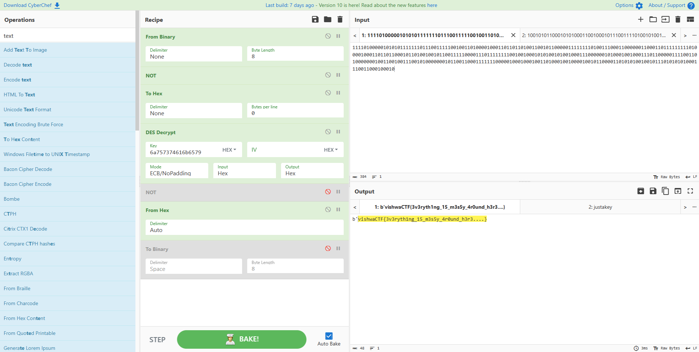

# 0 | 1
- `encrypt.c` was **DES encryption in ECB mode**
- `isThisFileUseful.txt` had the key for encryption
- `justBinaries.txt` was the cipher text but the bits were reversed using `up_down.py`
- Input everything in ***CyberChef*** to get the flag


```
vishwaCTF{3v3ryth1ng_15_m3s5y_4r0und_h3r3....}
```