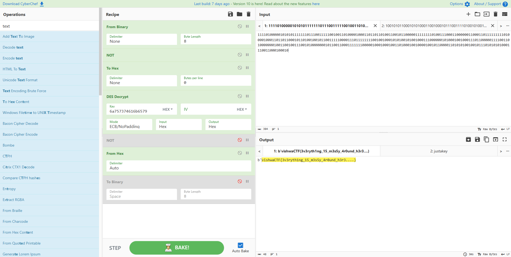

# VishwaCTF_2023_Writeups
Our writeups for VishwaCTF 2023<br><br>
Team Name - **BITSkrieg**<br>
Rank - **#6/1090**<br>
Flags - **28/47**<br>
First Bloods - **3**<br>
Points - **7118**

## Sharing is Caring
```

```

## CID
- We are provided with an image `case69.jpg`. Nothing much in the picture, but reveals a password on checking metadata. Tried steghide with password, nothing
- Tried `binwalk`, reveals a `7z` file. Extracted it, and found several images with a text file. Text file of not much use
- All the images were of same size, except one `369.jpg`
- On applying `steghide` with the password found in metadata - ***"daya darwaza tod do"*** we get `flag.txt`
```
vishwaCTF{my_GOD_D4ya_tumn3_t0_fl4g_dhund_liy4....}
```

## My FOOLish Opponent
- The position given in the board and the title of the question suggests ***Fool's mate***
- The answer was one of the variations of the same
```
VishwaCTF{f3_e6_g4_Qh4#}
```

## I am an Investigator
- We are given a corrupted image `RealFirst.png`. As we can see the header reads `BHAI` :)
- I fixed the magic bytes to `89 50 4E 47` and got the image
- The image talks about ***Latitude*** & ***Longitude*** as being the length and breadth of the image respectively **(in cm)**
- I checked the metadata of the image using `exiftool`
- We get size of image as `6186 x 614` & resolution as `118.1098901`

$Latitude = \frac{6186}{118.1098901} = 52.3749$
<br>

$Longitude = \frac{614}{118.1098901} = 5.1985$

- On entering these values on Google Maps, we landed up somewhere in Netherlands
- I checked out `Beatrixpark Dock` cause it seemed the nearest tourist attraction & I found a review by `vishwa_crimebranch`
- As it said, I went to the instagram with the same username & found a Drive link in the post, it contained a `.mp4` video with a very small width
- 

## Super23
```

```

## XOR
```

```

## Email Incoming
```

```

## Mascot
```

```

## Nice guys finish last
```

```

## Welcome to VISHWACTF'23!
- Sanity check
```
VishwaCTF{w3_ar3_an0nym0u5_w3_4r3_l3g1on_w3_d0_not_f0rg1v3_w3_do_not_f0rg3t}
```

## Quick Heal
```

```

## Wednesday Thursday Friday
- Revered the binary in ghidra
- There were some equations which the flag had to satisfy
- Used the z3 solver to solve the equations to get the value of flag.
- Refer to the [wed_thur_fri.py](assets/wed_thur_fri.py)
```

```

## Reversing is Ezeeee....
```

```

## aLive
```

```

## Payload
```

```

## Eeezzy
```

```

## Phi-Calculator
```

```

## Guatemala
```

```

## Mystery of Oakville Town
```

```

## The Sender Conundrum
```

```

## 1nj3ct0r
```

```

## I LOVE YOU
```

```

## Just Files
```

```

## Can you see me?
- We were given an image. On applying `binwalk` to it, we get a zip file with an audio file
- On viewing the spectogram of this `.wav` file in **Audacity**, we get the flag
```
vishwaCTF{n0w_y0u_533_m3}
```

## Privacy Breach
```

```

## Fr1endship Forever
```

```

## Blockblaster
```

```

## 0 | 1
- `encrypt.c` was **DES encryption in ECB mode**
- `isThisFileUseful.txt` had the key for encryption
- `justBinaries.txt` was the cipher text but the bits were reversed using `up_down.py`
- Input everything in ***CyberChef*** to get the flag


```

```