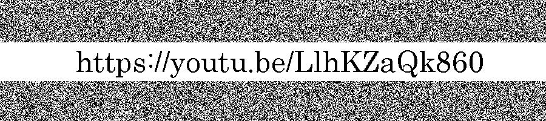

# XOR
- Found the ciphertext `IFAUCLJXLIWUKQZTGIWUIMZS` in the metadata of the image, which decodes to `AAA-7Z-EC32-D32` using **Base32**
- Using the above decoded string, we applied `steghide` & got the `secret.zip` file, which contains 2 image files
- Now as the challenge name suggests, we applied `XOR` on the images & got the link
```
gmic n1.png n2.png -blend xor -o result.png
```

```
VishwaCTF{https://youtu.be/LlhKZaQk860}
```